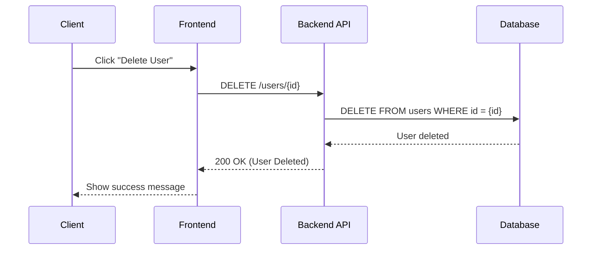

## 🎯 Acceptance Criteria

> [!NOTE]
> The following are developer friendly images and comments to explain what will be accepted as done.

I want a `deleteUser` endpoint that takes a user `id` and deletes them from the database.

The endpoint should return with whether it was successful or not at deleting the user.

...(DELETE THIS PLACEHOLDER CONTENT)

## 🧪 Testing

> [!NOTE]
> The following are what the unit tests expect once development is done.

When the `deleteUser` endpoint gets a request with **no** `id` I **EXPECT**:
- The request to return with a failing status code and a message explaining why it failed, "No ID was supplied."

---

When the `deleteUser` endpoint gets a request with a  `id` where the user exists I **EXPECT**:
- The backend to send a query to the database to delete that user.
- The request to return with a successful status code (200) if the database was successful with deleting the user.

---

When the `deleteUser` endpoint gets a request with a `id` where the user doesn't exist I **EXPECT**:
- The backend to send a query to the database to delete that user.
- The database to return an error since it can't find the user.
- The request to return with a NOT FOUND status code (404) since the database couldn't find the user and a error message saying "User could not be deleted since it wasn't found."

---

... (DELETE THIS PLACEHOLDER CONTENT)

## 🔗 Links & Notes

> [!NOTE]
> The following are links and any other notes to aid other developers and leads.

- [Google](google.com)
- I ran into an issue when implementing this and found this workaround...
- ... (DELETE THIS PLACEHOLDER CONTENT)
